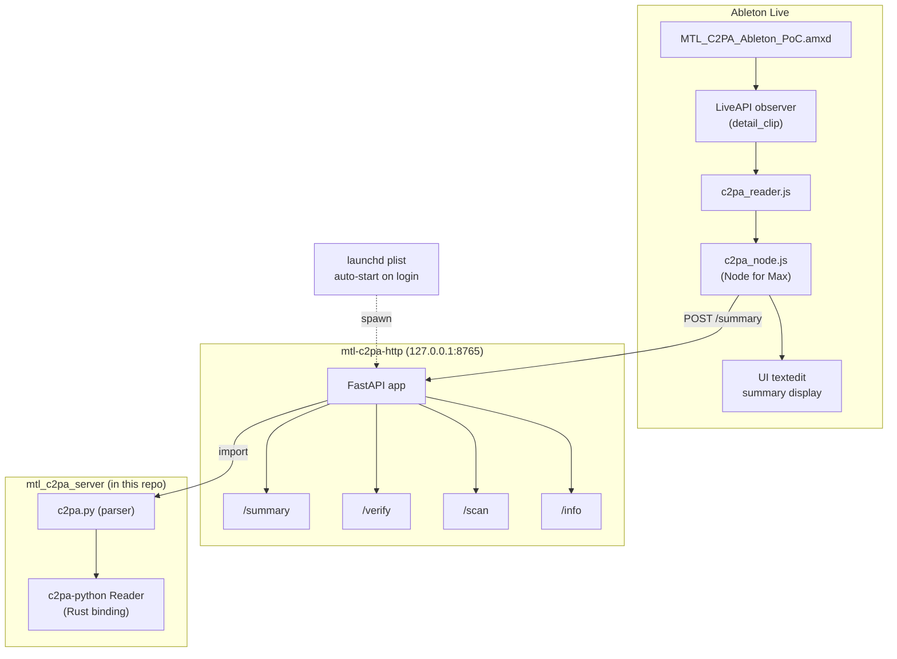
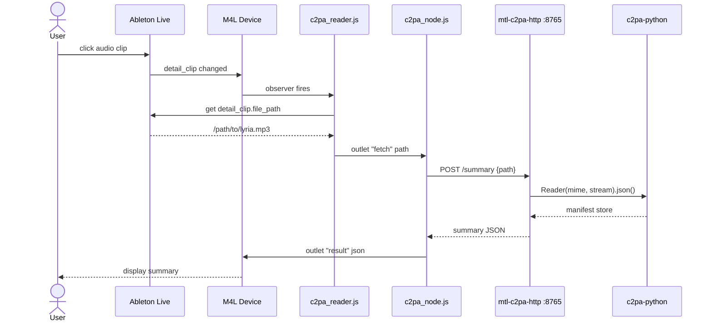

# Architecture

## Overview

The device displays a C2PA manifest summary for the audio clip currently selected in Ableton Live's Detail View. It does so by:

1. Observing the `live_set view detail_clip` property via the Live Object Model (LOM).
2. Resolving the selected clip's `file_path`.
3. POSTing the path to the local FastAPI server (`mtl-c2pa-http`, shipped in this repo as `src/mtl_c2pa_server/`) on `127.0.0.1:8765`.
4. Rendering the JSON response in a `textedit` UI element.

The local server (`mtl_c2pa_server`, shipped in this same repo) wraps the official `c2pa-python` Rust binding. One clone, one `poetry install`, no separate dependency on the sibling MCP server.

## Component diagram

## Selection-to-display sequence

The manual "Refresh" `textbutton` short-circuits the observer and triggers the same `POST /summary` call — same pipeline, different trigger source.

## Why a local HTTP server (and not alternatives)

| Option | Why not |
|--------|---------|
| CLI shell-out per request | Python startup cost (~300 ms) is noticeable on every clip selection. |
| Embed `c2pa-python` in Max JS | Max's `js` object can't host the Rust binding; would need a JS rewrite or a native external. |
| Cloud Run | Adds network dependency to inspect a local file the user already has on disk. Right for *generation*, wrong for *reading*. |

A persistent local FastAPI server keeps `c2pa-python` warm, runs on loopback only (no external attack surface), and is shipped in this same repo as the device.
