# C2PA in Ableton: making AI music provenance visible inside your DAW

In May 2026 we shipped a Claude MCP for [reading C2PA manifests in music files](/blog/music-data/c2pa-in-music-mcp). This post is the follow-up: the same reader, now inside Ableton Live.

This is the fourth article in our [Max for Live series](/blog/software-development/exporting-ableton-live-locators-to-json-with-max-for-live). It builds directly on the [M4L → FastAPI pattern](/blog/software-development/connecting-your-max-for-live-device-to-a-cloud-api) we wrote about in January, with one change: the API runs on your laptop, not in the cloud.

## The problem

Google Lyria signs every MP3 it generates with a C2PA manifest. The manifest records who made the file, what model produced it, whether it's AI-generated, what watermarks were applied (Lyria adds SynthID), and who signed the claim. The data is there. Producers can't see it.

You drop a Lyria stem onto an audio track. Ableton shows you the waveform. It doesn't show you that the file is AI-generated, who signed it, or what the manifest says about the source. To find out, you have to leave the DAW, run `c2patool` on the file, and read raw JSON.

Andrew Melchior — Massive Attack's CTO, advising UK DCMS/DSIT on AI and the Copyright Act — framed the bigger gap in [a reply on LinkedIn](https://linkedin.com/) to our MCP announcement:

> "C2PA now tells you a machine generated this track. It doesn't tell you whose work trained the machine."

Training-corpus provenance is the hard problem. The article you're reading is about the easier half — making the *output* manifest visible at the point a producer is actually working.

## The fix

A Max for Live device. Click a clip → see the manifest summary. That's the whole product.


Under the hood, the device borrows a pattern we already shipped: a Max for Live `js` object reads the Live Object Model, then routes the work to a Node for Max HTTP client. We wrote about this exact shape in [Connecting Your Max for Live Device to a Cloud API](/blog/software-development/connecting-your-max-for-live-device-to-a-cloud-api). The only change here is where the HTTP server lives.

## Architecture in one diagram



Three sentences:

1. A LiveAPI observer in the `js` object watches `live_set view detail_clip`. When the selection changes, it pulls the clip's `file_path`.
2. The path flows into a Node for Max script, which POSTs it to `http://127.0.0.1:8765/summary`.
3. The local FastAPI server is shipped in this same repo (`src/mtl_c2pa_server/`). Wraps `c2pa-python` directly.

## Why local, not cloud, not CLI

We considered three options. Local won.

**A CLI shell-out per click** sounds simplest, but Python startup costs about 300 ms. On every clip selection. You feel it.

**Cloud Run** is what our [reference M4L → API article](/blog/software-development/connecting-your-max-for-live-device-to-a-cloud-api) uses. It's the right answer when you want a multi-user audit log of *generation* events. It's the wrong answer for *reading* a file the user already has on disk — you'd be uploading audio to a server just to ask "is this AI-generated?" when the manifest is right there in the file.

**A local FastAPI server** keeps `c2pa-python` warm in memory, runs on loopback only (no external attack surface), and reuses the existing MCP parser without changes. It's the only option that's both fast and architecturally honest.

## What you see

For a Lyria-signed MP3, the device shows the same shape our MCP produces:

```json
{
  "file": "/Users/you/Music/Sovereign_Ascent.mp3",
  "generator": {"name": "Google C2PA Core Generator Library"},
  "is_ai_generated": true,
  "actions": [
    {"action": "c2pa.created", "description": "Created by Google Generative AI."},
    {"action": "c2pa.edited", "description": "Applied imperceptible SynthID watermark."}
  ],
  "watermarks": [
    {"description": "Applied imperceptible SynthID watermark."}
  ],
  "signature_issuer": "Google LLC",
  "validation": "valid"
}
```

For an unsigned audio clip you get `{"error": "No C2PA manifest found"}`. For a MIDI clip, `{"info": "MIDI clip — no C2PA manifest applicable"}`. The Refresh button re-runs the lookup manually.

## What this doesn't solve

This is read-side only. The device tells you the C2PA truth that's *already in the file*. It doesn't sign anything. It doesn't tell you what corpus trained the model — Andrew's point still stands.

The C2PA community is working on the harder problem. There's an active conversation in the C2PA group about capturing provenance *during* DAW work — signing the project at bounce time, attributing the samples and MIDI sources that went in. That's the generation side. We'd like to help build it next.

## Install and try it

You need Ableton Live with Max for Live (Live Suite, or Standard + the M4L add-on), and macOS for the auto-start script.

```bash
# 1. Clone and install (one-time)
git clone https://github.com/musictechlab/mtl-c2pa-ableton.git
cd mtl-c2pa-ableton && poetry install

# 2. Auto-start it on login
git clone https://github.com/musictechlab/mtl-c2pa-ableton.git
cd mtl-c2pa-ableton && bash install/install.sh

# 3. Drop the device on a track
# Drag device/MTL_C2PA_Ableton_PoC.amxd onto any audio track in Live.
```

That's it. Click a Lyria clip — see the manifest. Full setup detail in the [repo README](https://github.com/musictechlab/mtl-c2pa-ableton).

## Roadmap

Generation-side device next. The plan is a Max for Live effect that signs the project at bounce time and emits a C2PA manifest describing the session's ingredients — samples, MIDI sources, plugin chain. We'd like input from the C2PA DAW PoC group before settling on the assertion shape.

If you're interested in the broader open-source MCP family, we've shipped a few related ones already:

- [mtl-metadata-mcp](/blog/music-data/mtl-metadata-mcp-open-source-audio-metadata-embedding) — read and write ID3 / FLAC / Vorbis tags from Claude.
- [Verified Human Cert MCP](/blog/software-development/mcp-verified-human-cert-open-source) — verify human-made music certifications. Complementary to C2PA: VHC says "a human made this"; C2PA says "this is how it was made."
- [mtl-bandcamp-mcp](/blog/music-data/mtl-bandcamp-mcp-open-source-revenue-dashboard) — natural-language queries over Bandcamp revenue reports.

There's also adjacent work on [extracting metadata from raw `.als` / `.asd` files](/blog/music-data/extracting-data-from-ableton-als-asd-files) if you want to go below the LiveAPI layer.

---

**Try it, break it, send feedback.** The device is MIT-licensed, the repo is [musictechlab/mtl-c2pa-ableton](https://github.com/musictechlab/mtl-c2pa-ableton). Issues and PRs welcome.

<!-- CTA: insert mtl/standard CTA via cta-generator skill -->
